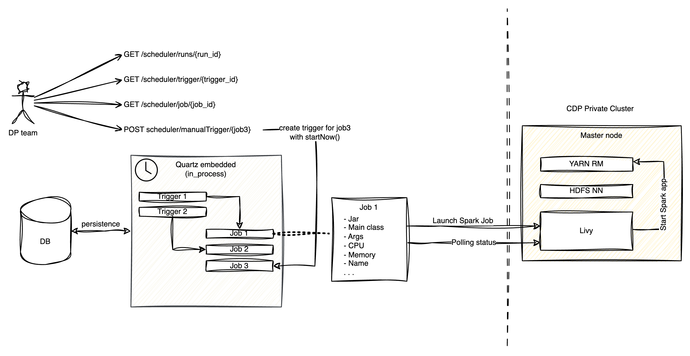

# High Level Design

This document describes the High Level Design of the CDP Spark Specific Provisioner.
The source diagrams can be found and edited in the [accompanying draw.io file](HLD_clouderaPrivate.drawio).

## Specific Provisioner

A Specific Provisioner (SP) is a service in charge of performing a resource allocation task, usually
through a Cloud Provider. The resources to allocate are typically referred to as the _Component_, the
details of which are described in a YAML file, known as _Component Descriptor_.

The SP is invoked by an upstream service of the Witboost platform, namely the Coordinator, which is in charge of orchestrating the creation
of a complex infrastructure by coordinating several SPs in a single workflow. The SP receives
the _Data Product Descriptor_ as input with all the components (because it might need more context) plus the id of the component to provision, named _componentIdToProvision_

To enable the above orchestration a SP exposes an API made up of four main operations:
- validate: checks if the provided component descriptor is valid and reports any errors
- provision: allocates resources based on the previously validated descriptor; clients either receive an immediate response (synchronous) or a token to monitor the provisioning process (asynchronous)
- status: for asynchronous provisioning, provides the current status of a provisioning request using the provided token
- unprovision: destroys the resources previously allocated.

## Apache Spark™
Apache Spark™ is a multi-language engine for executing data engineering, data science, and machine learning on single-node machines or clusters.
Learn more about it on the [official website](https://spark.apache.org/).

## CDP Private Cloud
Cloudera Data Platform (CDP) Private Cloud Base serves as the foundation of Cloudera's on-premises data and analytics platform.

CDP Private Cloud Base supports hybrid solutions, separating compute tasks from data storage and enabling data access from remote clusters. This hybrid approach lays the groundwork for containerized applications by managing storage, table schema, authentication, authorization, and governance.

The structure of CDP Private Cloud Base is modular, allowing users to select combinations of services to create clusters tailored to business needs and workloads. Additionally, pre-configured packages of services are available to streamline deployment in common scenarios.

Find more information on the [official documentation](https://docs.cloudera.com/cdp-private-cloud/latest/index.html).

## Apache Livy

Apache Livy is an open-source RESTful web service designed to simplify how data scientists and developers interact with Spark clusters via a remote interface. Through its RESTful API, Livy allows for the submission of Spark jobs from anywhere. 

The Livy server can be deployed on a remote server that hosts a Spark cluster.
Upon receiving job requests, Livy executes these on the cluster and sends the results back to the requesting client, streamlining the process of working with Spark remotely.

For more information, please refer to the [official website ](https://livy.apache.org/).

## CDP Private Spark Specific Provisioner
This specific provisioner interacts in a synchronous way with a CDP Private Cluster by verifying provisioning requests and creating and destroying Spark Jobs.

### Validate

1. **Process Initiation:**
   The provisioner receives a provisioning request containing a YAML descriptor from the provisioning coordinator. This marks the beginning of the validation process.

2. **Descriptor Analysis:**
   In the initial phase, the descriptor is analyzed for correctness. This includes checking the syntax and the validity of the cron-expression intended for scheduling Spark jobs. Ensuring these elements are correct is crucial for the successful scheduling and execution of the job.

3. **Jar Verification:**
   Following the descriptor analysis, the process involves verifying the existence of the jar file indicated in the request communicating with HDFS NameNode (NN) to verify the specified HDFS path exists. This ensures the jar file is accessible in the Hadoop Distributed File System (HDFS).

4. **Outcome:**
   Upon finishing the verification, the provisioner returns a `ValidationResult` and proceeds with the next steps in the execution process. In case of any discrepancies or errors found during the validation process, appropriate error messages are communicated back to the requester.

### Provision

1. **Process Initiation:**
A provisioning request, containing a YAML descriptor, is sent to the provisioner from the provisioning coordinator.

2. **Request Validation:**
Upon receiving the request, the provisioner validates it to ensure compliance with required criteria. This validation is crucial for confirming that the processed requests are appropriate and authorized.

3. **Quartz Job Creation and Storage:**
If the request passes validation, the provisioner proceeds to create a Quartz job, which is then stored within the data storage system. This Quartz job represents the scheduled task to be executed.

4. **Scheduling and Trigger Storage:**
If scheduling information is provided within the request, a Quartz trigger associated with the job is also created and stored. This trigger outlines the execution timing for the job, specifying when and how often it should run.
If this information is not given, the provisioner schedules the job for a single execution at the time of the request.

5. **Handling Existing Jobs or Triggers:**
   If the job or trigger intended for provisioning already exists, it is deleted and recreated. This ensures the latest request is always accurately reflected in the system.

6. **Provisioning Status Feedback:**
After the job creation (and optionally the scheduling trigger), the provisioner returns a `ProvisioningStatus`. This status confirms the successful creation of the job in the system, focusing solely on the job's creation and scheduling.

**Job Execution and Results:**
The execution of Spark jobs is **not** managed by the provisioner, which only takes care of their scheduling.
Once they are scheduled, the Quartz scheduler takes care of launching the jobs according to the saved triggers.
Jobs are executed at their scheduled times through a call to Livy, which executes the Spark job on the cluster.
While the provisioner concludes its role with the return of the `ProvisioningStatus`, the execution outcome and job details can be monitored through YARN within Cloudera's cluster manager. This separate step is necessary for users to check the job's status and results.

### Unprovision

1. **Process Initiation:**
The provisioner receives a provisioning request containing a YAML descriptor from the provisioning coordinator.

2. **Request Validation:**
The provisioner validates the request by following the predefined steps. This validation ensures that the request meets the necessary criteria and is authorized for processing.

3. **Quartz Job Handling:**
After validation, the provisioner proceeds to destroy the Quartz Job stored within the data storage. This step involves removing the scheduled task from the system. The Quartz trigger associated with the job is also deleted, canceling any planned executions of the job.

4. **Results:**
 Following the completion of these actions, the provisioner returns a `ProvisioningStatus`. This status serves as confirmation of the request's processing, indicating that the job and any related scheduling have been successfully removed from the system.

### Job Status API (Still to Be Implemented)

Users have the capability to:

- Request information about jobs in a "running" state.
- Request information about a specific trigger.
- Request information about a particular job.
- Manually create a trigger for a job that did not previously possess one.

In the scenario where a trigger is manually created for a job:

- The provisioner creates a new Quartz trigger within the data storage, associated with the indicated job. This trigger is set for immediate start.
- Subsequently, the job is launched, initiating its execution based on the new trigger.

