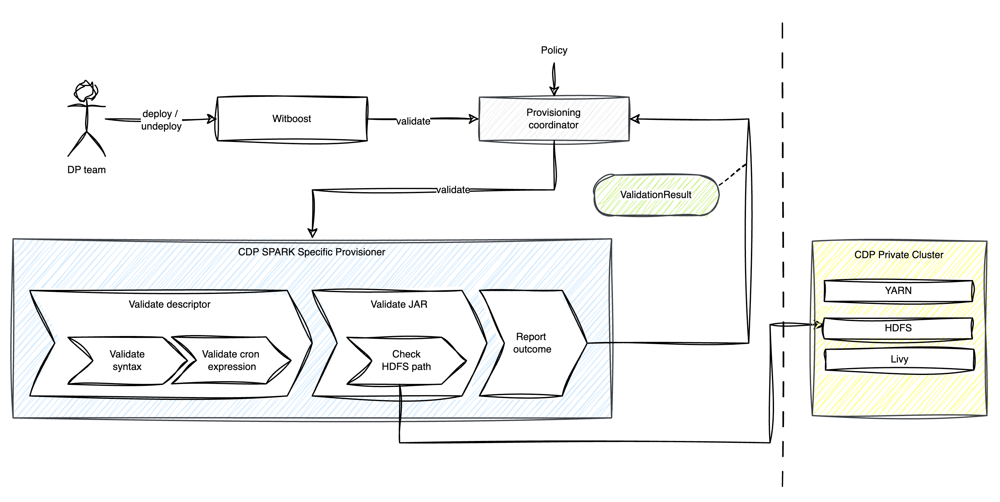
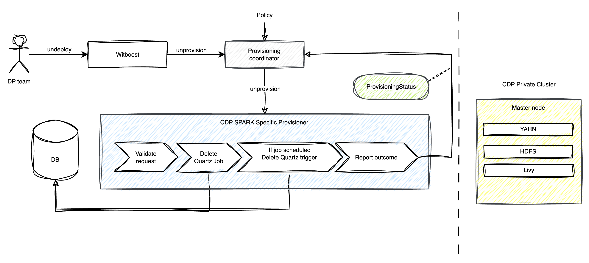

# High Level Design

This document describes the High Level Design of the CDP Spark Specific Provisioner.
The source diagrams can be found and edited in the [accompanying draw.io file](TODO).

## Overview

### Specific Provisioner

A Specific Provisioner (SP) is a service in charge of performing a resource allocation task, usually
through a Cloud Provider. The resources to allocate are typically referred to as the _Component_, the
details of which are described in a YAML file, known as _Component Descriptor_.

The SP is invoked by an upstream service of the Witboost platform, namely the Coordinator, which is in charge of orchestrating the creation
of a complex infrastructure by coordinating several SPs in a single workflow. The SP receives
the _Data Product Descriptor_ as input with all the components (because it might need more context) plus the id of the component to provision, named _componentIdToProvision_

To enable the above orchestration a SP exposes an API made up of four main operations:
- validate: checks if the provided component descriptor is valid and reports any errors
- provision: allocates resources based on the previously validated descriptor; clients either receive an immediate response (synchronous) or a token to monitor the provisioning process (asynchronous)
- status: for asynchronous provisioning, provides the current status of a provisioning request using the provided token
- unprovision: destroys the resources previously allocated.

### Apache Spark™
Apache Spark™ is a multi-language engine for executing data engineering, data science, and machine learning on single-node machines or clusters.
Learn more about it on the [official website](https://spark.apache.org/).

### CDP Private Cloud
Cloudera Data Platform (CDP) Private Cloud Base serves as the foundation of Cloudera's on-premises data and analytics platform.

CDP Private Cloud Base supports hybrid solutions, separating compute tasks from data storage and enabling data access from remote clusters. This hybrid approach lays the groundwork for containerized applications by managing storage, table schema, authentication, authorization, and governance.

The structure of CDP Private Cloud Base is modular, allowing users to select combinations of services to create clusters tailored to business needs and workloads. Additionally, pre-configured packages of services are available to streamline deployment in common scenarios.

Find more information on the [official documentation](https://docs.cloudera.com/cdp-private-cloud/latest/index.html).

### CDP Private Spark Specific Provisioner
This specific provisioner interacts in a synchronous way with a CDP Private Cluster by verifying provisioning requests and creating and destroying Spark Jobs.

#### Validate
The provisioner receives a provisioning request containing a YAML descriptor from the provisioning coordinator.  

In the initial phase, the descriptor is anlyzed: the correctness of the syntax and cron-expression given to schedule Spark jobs is checked.

Then the check is done on the jar indicated in the request: it is verified the existence of the HDFS path (communicating with HDFS NN) and also the existence of the main class in the file.

#### Provision
The provisioner receives a provisioning request containing a YAML descriptor from the provisioning coordinator.  
It validates the request by following the steps described above and then creates the Quartz job within the data storage. If a job-scheduling is provided, a Quartz trigger related to the job will also be saved on the storage.

As outcome, it returns a ProvisioningStatus.

Note: If the job or trigger you want to provision already exist this is deleted and recreated.

#### Unprovision
The provisioner receives a provisioning request containing a YAML descriptor from the provisioning coordinator.  
It validates only the request descriptor by following the steps described above and then destroys the Quartz Job inside the data storage.
If a job-scheduling has been provided, the Quartz trigger related to the job is also deleted.

As outcome, it returns a ProvisioningStatus.

#### Job status API

The user can:
- request information about jobs in a "running" state;
- request information about a specific trigger;
- request information about a particular job;
- manually create a trigger for a job that did not previously possess it.

In the last case the provisioner creates in the data storage a new Quartz trigger associated with the indicated job with immediate start, and launches the job.

Once the execution is complete the status of the Quartz job mirrors that of the Spark job associated with it. If the Spark job succeeds then so will the Quartz job and similarly if the Spark job fails the Quartz job will also fail.