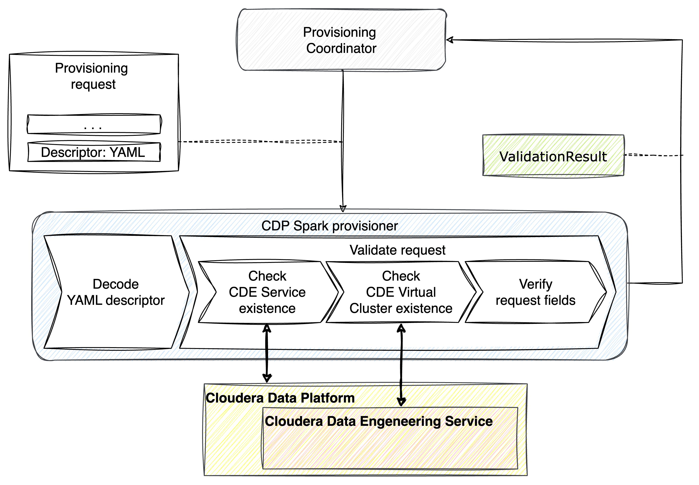
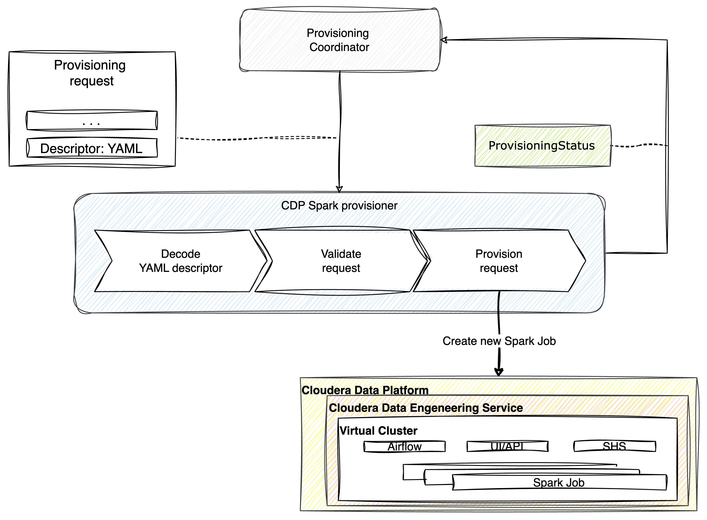
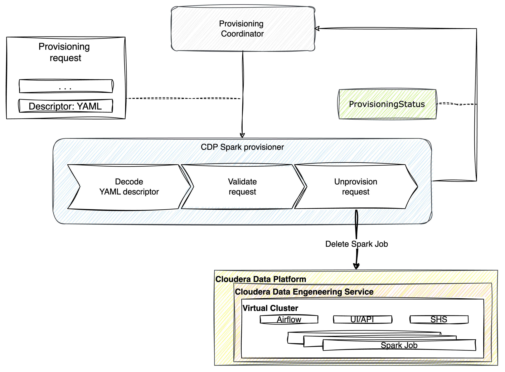

# High Level Design

This document describes the High Level Design of the CDE Spark Specific Provisioner.
The source diagrams can be found and edited in the [accompanying draw.io file](hld.drawio).

## Overview

### Specific Provisioner

A Specific Provisioner (SP) is a service in charge of performing a resource allocation task, usually
through a Cloud Provider. The resources to allocate are typically referred to as the _Component_, the
details of which are described in a YAML file, known as _Component Descriptor_.

The SP is invoked by an upstream service of the Witboost platform, namely the Coordinator, which is in charge of orchestrating the creation
of a complex infrastructure by coordinating several SPs in a single workflow. The SP receives
the _Data Product Descriptor_ as input with all the components (because it might need more context) plus the id of the component to provision, named _componentIdToProvision_

To enable the above orchestration a SP exposes an API made up of four main operations:
- validate: checks if the provided component descriptor is valid and reports any errors
- provision: allocates resources based on the previously validated descriptor; clients either receive an immediate response (synchronous) or a token to monitor the provisioning process (asynchronous)
- status: for asynchronous provisioning, provides the current status of a provisioning request using the provided token
- unprovision: destroys the resources previously allocated.

### Apache Spark™
Apache Spark™ is a multi-language engine for executing data engineering, data science, and machine learning on single-node machines or clusters.
Learn more about it on the [official website](https://spark.apache.org/).

### Cloudera Data Engeneering (CDE)
Based on Apache Spark, Cloudera Data Engineering is a data engineering toolset that enables orchestration automation with Apache Airflow, 
advanced pipeline monitoring, visual troubleshooting, and comprehensive management tools to streamline ETL processes across enterprise analytics teams.
CDE is fully integrated with [Cloudera Data Platform](https://www.cloudera.com/products/cloudera-data-platform.html) (CDP).

### CDE Spark Specific Provisioner
This specific provisioner interacts in a synchronous way with a CDE environment by verifying provisioning requests and creating and destroying Spark Jobs.

All operations that the provisioner can perform are called by a provisioning coordinator as a result of the creation or update of a Data Product on the Witboost platform.

#### Validate
The provisioner receives a provisioning request containing a YAML descriptor from the provisioning coordinator.  
In the initial phase, the descriptor is decoded. Next, during the 'request validation' phase, the validator verifies the existence of the CDE service and cluster on the CDP. If this validation phase is passed successfully, the final check involves verifying the correctness of the fields provided.  
This operation does not alter the CDE environment, and the only outcome is a ValidationResult.

#### Provision
The provisioner receives a provisioning request containing a YAML descriptor from the provisioning coordinator.  
It validates the request following the steps described above and then creates on the CDP a new Spark Job inside the Virtual Cluster.  
As outcome, it returns a ProvisioningStatus.

#### Unprovision
The provisioner receives a provisioning request containing a YAML descriptor from the provisioning coordinator.  
It validates the request following the steps described above and then destroys the Spark Job inside the Virtual Cluster.
As outcome, it returns a ProvisioningStatus.

Note: In case the provisioner does not find the CDE Service and/or CDE Virtual cluster active the unprovisioning request is still considered completed and the output message will be "Unprovision skipped" followed by the error list.